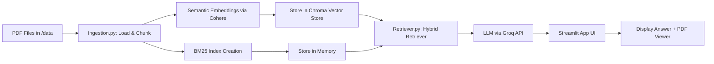

# 📚 RAG System with Hybrid Search + PDF Viewer  
**Technologies:** Streamlit • LangChain • Groq API • Cohere Embeddings • Qdrant Vector Store • BM25 Sparse Retrieval  

---

## 🔍 Project Overview
This project implements an **Retrieval-Augmented Generation (RAG)** pipeline with a focus on **research paper exploration**.  
Unlike generic RAG demos, it combines **semantic vector retrieval** with **lexical BM25 scoring** to maximize recall & precision, while enabling a side-by-side PDF reader for direct source inspection.

The entire pipeline is optimized for **free-tier inference** and **non-local LLM execution** via **Groq API**, making it deployable even on CPU-limited machines.

---

## 🧠 Concepts Used

### 1️⃣ **Hybrid Retrieval (BM25 + Dense Embeddings)**
- **Dense Retrieval:** Cohere embeddings (`embed-english-v3.0`) are used for **semantic similarity**. This captures meaning beyond exact word matches.
- **Sparse Retrieval (BM25):** A keyword-based algorithm to handle **exact term matches** and **rare term recall** where embeddings might fail.
- **Why Hybrid?**  
  - Dense = good for paraphrased queries, but may hallucinate results if the meaning is fuzzy.  
  - Sparse = good for technical terms, acronyms, or rare entities.  
  - Merging both ensures high **recall** and **precision**, especially in research papers with domain-specific vocabulary.

---

### 2️⃣ **Semantic Chunking with RecursiveCharacterTextSplitter**
- **Recursive Splitter:** Splits content hierarchically (paragraph → sentence → token) ensuring chunks respect semantic boundaries.
- **Why not fixed-size chunks?**  
  - Prevents breaking formulas, tables, or definitions mid-sentence.  
  - Increases embedding quality by preserving context.

---

### 3️⃣ **BM25 Index Persistence**
- BM25 index is pre-computed and **stored in memory at runtime** for instant retrieval.
- No disk persistence — designed for small to medium document sets, reducing I/O latency.

---

### 4️⃣ **Groq API for Fast LLM Inference**
- LLM calls use **Groq's API** via LangChain integration (`ChatGroq`) — selected because:
  - Extremely low latency (~50-200ms/token).
  - Free-tier API available for experimentation.
- Avoids local model inference due to CPU limitations.

---

### 5️⃣ **Side-by-Side PDF Viewer in Streamlit**
- Integrated `streamlit-pdf-viewer` component allows users to:
  - **Read the source paper** alongside the AI-generated answer.
  - **Validate model responses** instantly without switching tabs.
- This improves **trust** and **user interpretability**.

---

## ⚙️ Project Flow



# Setup

```bash
# Clone repo
git clone [https://github.com/YOUR_USERNAME/rag-project.git](https://github.com/darshanlahamage/RAG-Hybrid-Search-research-assistant.git)
cd rag-project

# Install dependencies
pip install -r requirements.txt

# Add API keys
cp .env.example .env
# Edit .env with your COHERE_API_KEY and GROQ_API_KEY

# Ingest PDFs into vector DB + BM25 index
python ingestion.py

# Run Streamlit app
streamlit run app.py
```
